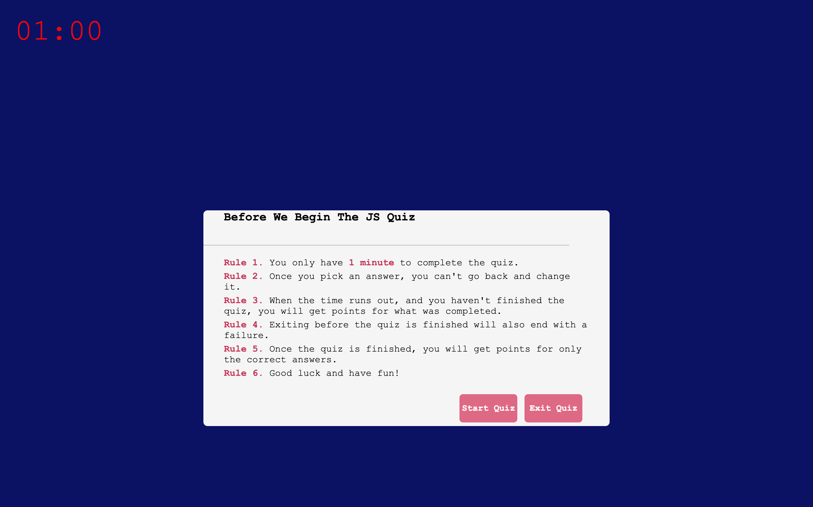

# JavaScript Quiz
by Eduard Voicu

## User Story

AS a USER I want to take a quick knowledge quiz on JavaScript. While taking this quiz I want to have a timer that I go against and will be penalized for it if I get the answer wrong.
At the end of the quiz I want to be able to save my highest score and see it.

THE deployed application provided the USER with a set of RULES before starting the quiz. Once the quiz starts, the user has a set amount of time to go through the quiz.

## Mock-Up

The following is a screenshot of the deployed application.

## Links
[GitHub Repo](https://github.com/eduardvoicu/quiz)

[GitHub Deployed Page](https://eduardvoicu.github.io/quiz/)

